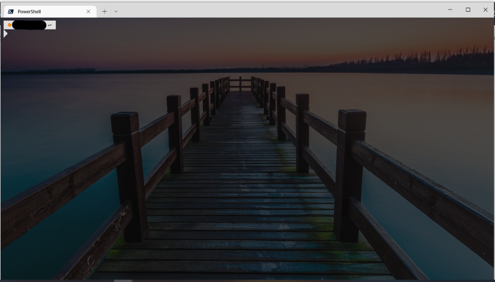

# Workstation Configuration
PowerShell script to set up a Windows workstation with needed software.

## Quick Start (New VM)

Run the following one-liner in **Administrator PowerShell**, replacing `mrldev` with your desired role:

```powershell
Invoke-RestMethod -Uri "https://raw.githubusercontent.com/101solution/workstation-setup/main/get-latestPackages.ps1" -OutFile "$env:temp\get-latestPackages.ps1"; powershell.exe -executionpolicy bypass -file $env:temp\get-latestPackages.ps1 -role mrldev
```

## Available Roles

| Role | Description |
|------|-------------|
| `mrldev` | Full developer setup — VS Enterprise, SSMS, DBeaver, Sourcetree, TortoiseGit, Power BI, Wireshark, and more |
| `mrl` | Lighter setup — Terraform, .NET SDK 8, Azure CLI, Postman, AWS CLI, PowerToys, Storage Explorer, AZCopy |
| `cloudEngineer` | Cloud engineering — kubectl, Terraform, .NET SDK 7, Azure CLI, minikube, Postman, AWS CLI, NodeJS |
| `runner` | GitHub Actions self-hosted runner — minimal toolset |
| `ce-corp` | Docker CE setup with Visual Studio Enterprise |
| `ce-free` | Docker CE setup with Visual Studio Community |

All roles include the base packages from `packages-min.json`: PowerShell, Git, VS Code, Oh My Posh, Windows Terminal, Ditto, Bing Wallpaper, 7-Zip, posh-git, PSReadLine, PSRule.

## Manual Setup

1. Open PowerShell in **Administrator** mode
2. Run:
```powershell
powershell.exe -executionpolicy bypass -file .\config-workstation.ps1 -role <role>
```

## Terminal

The script configures Oh My Posh and PSReadLine, inspired by:
- [My Ultimate PowerShell prompt with Oh My Posh and the Windows Terminal](https://www.hanselman.com/blog/my-ultimate-powershell-prompt-with-oh-my-posh-and-the-windows-terminal)
- [You should be customizing your PowerShell Prompt with PSReadLine](https://www.hanselman.com/blog/you-should-be-customizing-your-powershell-prompt-with-psreadline)


