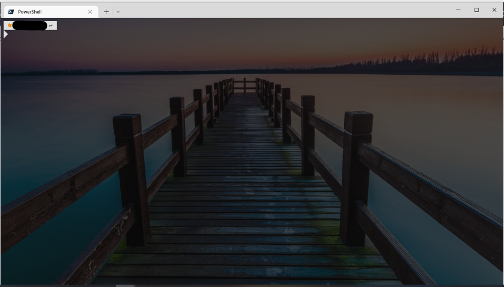

# Workstation Configuration

PowerShell scripts that set up a Windows workstation from a role-based package manifest. Setup is
**unattended**: nothing prompts for input, at most one reboot happens (at the very end, only if WSL2
had to be enabled), and setup resumes by itself after that reboot.

## Quick Start (New VM)

Run the following one-liner in **Administrator PowerShell**, replacing `mrldev` with your desired role:

```powershell
Invoke-RestMethod -Uri "https://raw.githubusercontent.com/101solution/workstation-setup/main/get-latestPackages.ps1" -OutFile "$env:temp\get-latestPackages.ps1"; powershell.exe -executionpolicy bypass -file $env:temp\get-latestPackages.ps1 -role mrldev
```

This downloads the latest release to `c:\config\workstation` and runs `config-workstation.ps1`. Walk
away: if Windows restarts, a logon-triggered task finishes the last step (registering the Ubuntu
distro) and removes itself.

Last validated end to end on 2026-09-16, on **both a Windows 11 Enterprise 24H2 client and a Windows
Server 2025 box**: role `mrldev` in 9 phases, one reboot, 33 minutes including Visual Studio
Enterprise 2026, and role `mrl` in 16 minutes. The Docker CE step, with both daemons verified, passed
on Windows 11 on 2026-09-14 and on Server 2025 on 2026-09-16.

To set your git identity at the same time, add `-gitUser` and `-gitEmail` — they are forwarded to
`config-workstation.ps1`:

```powershell
Invoke-RestMethod -Uri "https://raw.githubusercontent.com/101solution/workstation-setup/main/get-latestPackages.ps1" -OutFile "$env:temp\get-latestPackages.ps1"; powershell.exe -executionpolicy bypass -file $env:temp\get-latestPackages.ps1 -role mrldev -gitUser "Your Name" -gitEmail "you@example.com"
```

Without them the shipped `.gitconfig` sets no identity, so `git commit` will ask who you are.

### Updating a machine that is already set up

Run the same one-liner again. It downloads whatever release is now Latest, notices that this machine
was configured by a different version, and redoes every phase so the new packages and fixes actually
land. This works even for a machine set up before version tracking existed: no recorded version
counts as a mismatch. Expect roughly the time of a fresh run minus the reboot — WSL2 is already
enabled, so there is none.

This needs the Latest release to be `v2.5.2` or newer, since the mismatch is detected by the
release's own `config-workstation.ps1`. `v2.5.2` is Latest, so the one-liner handles it. On an older
release the one-liner cannot detect anything — it says so rather than pretending, and you then redo
the phases yourself with `-force`. Without it the run finds its saved progress, skips every phase in
about a second and reports success having installed nothing:

```powershell
powershell.exe -executionpolicy bypass -file c:\config\workstation\config-workstation.ps1 -role mrldev -force
```

`get-latestPackages.ps1` has no `-force` of its own, so call `config-workstation.ps1` directly — the
one-liner has already downloaded it to `c:\config\workstation`. Add `-gitUser` / `-gitEmail` here too
if you want the git identity applied, since that also lives in a phase that would otherwise be
skipped.

## Available Roles

| Role | Description |
|------|-------------|
| `mrldev` | Everything in `mrl`, plus VS Enterprise, SSMS, DBeaver, Sourcetree, TortoiseGit, Power BI, Wireshark, WinSCP, Notepad++ |
| `mrl` | Lighter setup — Terraform, .NET SDK 10, Azure CLI, Bruno, AWS CLI, PowerToys, Storage Explorer, AZCopy, Service Bus Explorer |
| `cloudEngineer` | Everything in `mrl`, plus kubectl and minikube |
| `developer` | .NET SDK 10, Azure CLI, Bruno, Terraform |
| `min` | The base packages only, nothing role-specific |

Every role layers on the base packages from `packages-min.json`: PowerShell, Git, GitHub CLI,
VS Code, Oh My Posh, Windows Terminal, Ditto, Bing Wallpaper, 7-Zip, OneDrive, Claude Code,
Claude desktop, Codex CLI, Node.js LTS, Go, Python, Carapace, zoxide, fzf, jq, PSReadLine, PSRule,
powershell-yaml. `min` is just that base.

## Manual Setup

1. Clone the repo or unzip a release, then open PowerShell in **Administrator** mode.
2. Run:

```powershell
powershell.exe -executionpolicy bypass -file .\config-workstation.ps1 -role <role> -gitUser "Your Name" -gitEmail "you@example.com"
```

### Parameters

| Parameter | Default | Purpose |
|-----------|---------|---------|
| `-role` | `mrldev` | Which `packages-<role>.json` to install |
| `-gitUser`, `-gitEmail` | unset | Written to the global git config when given |
| `-defaultWorkFolder` | `c:\projects` | Created if missing. Becomes `$HOME` in the PowerShell 7 profile, the Windows Terminal starting directory and the Oh My Posh theme's home |
| `-enableWSL` | `$true` | Enable WSL2 and register Ubuntu with a ready-to-use user (passwordless sudo, systemd on). `-enableWSL $false` skips all of it |
| `-resumeMethod` | `ScheduledTask` | How setup comes back after the reboot: `ScheduledTask`, `RunOnce` or `None`. See below |
| `-noReboot` | off | Never restart. Exit code 3010 means a restart is owed; for image pipelines that sequence their own reboots |
| `-force` | off | Discard saved progress and redo every phase |
| `-taskName` | `workstation-config-resume` | Name of the resume task / `RunOnce` entry |
| `-setupVersion` | unset | Release tag being installed. Supplied automatically by `get-latestPackages.ps1`; when it differs from the tag recorded in the state file, every phase is redone. Leave it alone when running from a clone |

## Unattended execution and reboots

Setup runs as a series of named phases. Each completed phase is recorded in
`%ProgramData%\workstation-setup\setup-state.json`, so **re-running the same command is always safe**:
finished work is skipped and only what is left runs. A phase that fails is logged and retried on the
next run rather than aborting the build.

Skipping applies to *resuming an interrupted setup*, not to installing a newer release. The state
file also records the release tag it was set up by, so when the one-liner fetches a newer release
the phases are redone rather than skipped — otherwise an existing machine could never be upgraded.
`-force` redoes them unconditionally, which is what you need while the Latest release is still older
than `v2.5.2` and cannot detect the mismatch itself.

Phases are ordered so that everything that does not need a restart (packages, fonts, modules, shell
profile, terminal settings) completes first. Only registering the WSL distro waits for the reboot,
and there is at most one reboot. On a machine where WSL2 is already enabled there is none.

How setup resumes after that reboot is chosen with `-resumeMethod`:

| Value | Behaviour |
|-------|-----------|
| `ScheduledTask` (default) | A logon-triggered, elevated scheduled task finishes setup with no human input, then removes itself. The only fully hands-off option, because returning *elevated* after a reboot needs a task, a service or autologon. Falls back to `RunOnce` if task registration is blocked by policy |
| `RunOnce` | No scheduled task. An HKLM `RunOnce` entry relaunches setup after logon and asks for one UAC consent. Self-deleting |
| `None` | Arms nothing. Re-run the same command after the reboot; it finishes in seconds |

For an image pipeline that must control its own reboots:

```powershell
powershell.exe -executionpolicy bypass -file .\config-workstation.ps1 -role mrl -resumeMethod None -noReboot
# exit code 3010 => reboot, then run the identical line again
```

Transcript logs are written to `logs\` next to the script as `workstation-config-<date>.log`.

## Docker without Docker Desktop (optional)

**This step is opt-in and separate from the workstation setup.** Nothing in
`config-workstation.ps1` installs or needs Docker, so skip this section entirely if you do not
want it.

Run it *after* the workstation setup has finished, because the Linux daemon is installed inside
the WSL2 Ubuntu distro that setup registers:

```powershell
powershell.exe -executionpolicy bypass -file .\docker-ce\config-docker.ps1
```

It installs a Windows Docker daemon and a Linux one inside WSL2 side by side, with the same
unattended phase/resume behaviour and the same `-resumeMethod`, `-noReboot` and `-force` switches.
It keeps its own state file, so its progress and the workstation setup's can never interfere.
Details in [docker-ce/README.md](docker-ce/README.md).

It is a separate script rather than another phase because each entry point is designed to reboot
**at most once**, and these two need different restarts: the workstation setup reboots to register
the WSL2 distro, while `dockerd` cannot start until the Containers feature is live, which needs a
restart of its own.

Note that bare `docker` needs the WSL distro running, and WSL2 shuts an idle distro down after
about a minute. The install registers an at-logon task (`docker-ce-wsl-autostart`) that holds a
session open for you — it comes with this step, so a workstation-only machine will not have it.
If bare `docker` ever does fail, start the distro and retry:

```powershell
wsl -d Ubuntu -- /bin/true
docker run hello-world
```

Both flows have passed end to end on a fresh machine (2026-09-14, run 7 in `VALIDATION-HISTORY.md`): the Windows
daemon answers on 2378, and the WSL2 Linux daemon reports `os=linux` on 2375 and runs containers.

## Long paths

Setup lifts the 260-character `MAX_PATH` limit, which needs **two** unrelated opt-ins: the
`LongPathsEnabled` machine policy, which is what MSBuild, dotnet, Explorer and Windows PowerShell
honour, and git's own `core.longpaths`, which git needs because it ignores the machine policy
entirely. Both are set, and `core.longpaths` goes into git's system scope so it holds for every
account on the box.

Without it, cloning a repo that contains a path over 260 characters fails in a way that does not
look like a path problem: `git clone` exits 128 having already written thousands of files and no
index, so the half-finished clone shows up as thousands of uncommitted changes. No reboot is needed
— shells and tools started after setup pick the new limit up.

## PATH health

Setup deploys `path-health.ps1` next to the PowerShell profile, which loads it automatically, so
every shell has:

| Command | Does |
|---|---|
| `Test-PathHealth` | Audits User and Machine PATH and prints what is wrong |
| `Repair-PathHealth -Scope User` | Rewrites that scope, dropping wrong-scope, missing and duplicate entries. Supports `-WhatIf`; backs the old value up to `%LOCALAPPDATA%\workstation-setup\` first. `-Scope Machine` needs an elevated shell |

Windows truncates PATH near 2047 characters when a process is launched from the GUI, which breaks
tools in ways that look unrelated to PATH. The usual cause is not gradual growth but a program
writing the *merged* process PATH back into a single scope, which copies your user directories into
the machine-wide variable. That is invisible to ordinary de-duplication, because every entry is
still unique within its own scope — so the profile runs a cheap check at startup and warns if
anything looks wrong. Setup also logs a PATH audit after installing packages, so a run's transcript
shows the state at the time.

## Terminal

The script configures Oh My Posh for the prompt, PSReadLine for command-line editing (menu
completion on Tab, history search on the arrow keys, inline prediction), and Carapace for
completion of external commands - `git`, `terraform`, `az`, `kubectl`, `gh` and others, which
PowerShell cannot complete on its own. Prompt and editing setup are inspired by:
- [My Ultimate PowerShell prompt with Oh My Posh and the Windows Terminal](https://www.hanselman.com/blog/my-ultimate-powershell-prompt-with-oh-my-posh-and-the-windows-terminal)
- [You should be customizing your PowerShell Prompt with PSReadLine](https://www.hanselman.com/blog/you-should-be-customizing-your-powershell-prompt-with-psreadline)


